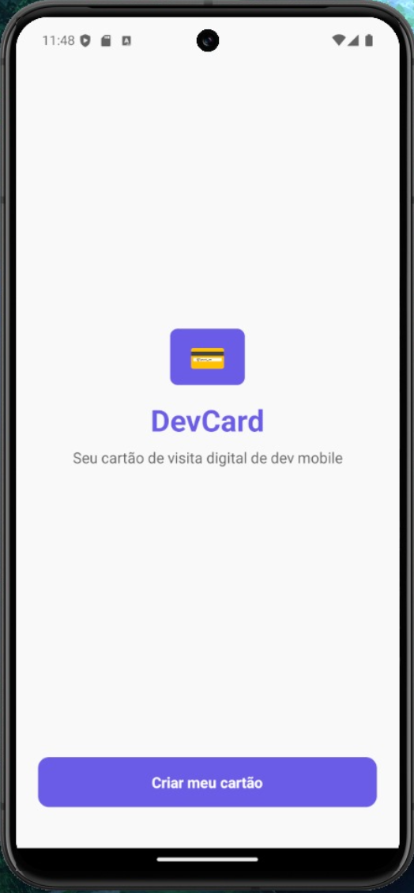
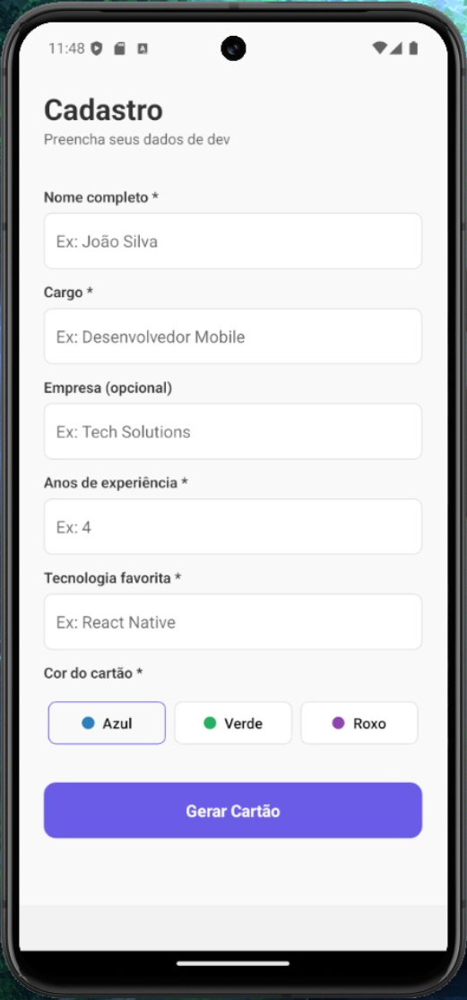
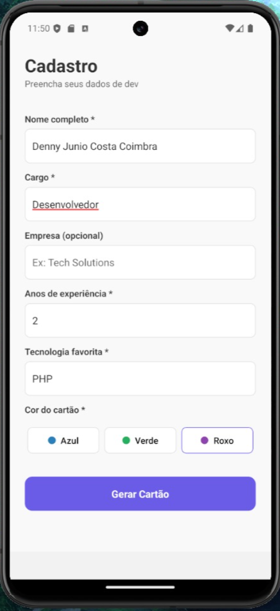
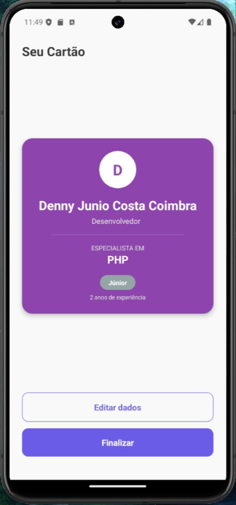
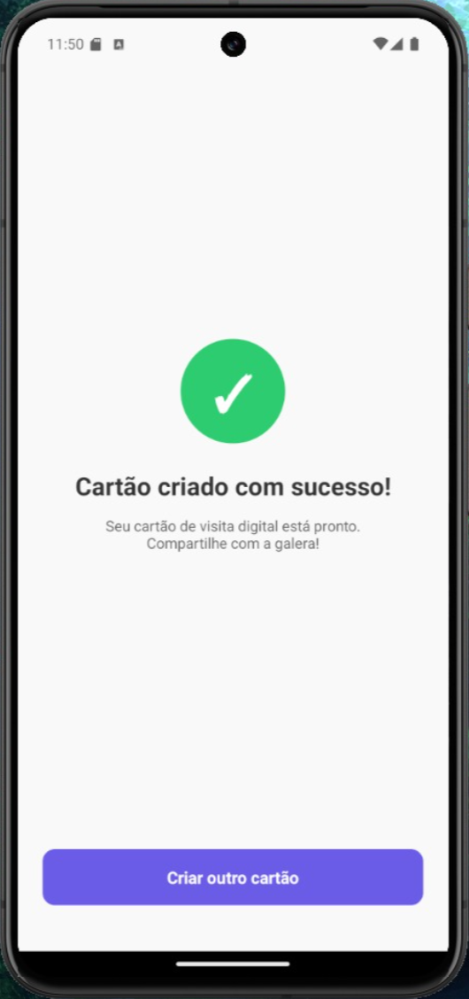

💳 DevCard

O DevCard é um aplicativo mobile desenvolvido para que desenvolvedores criem, personalizem e visualizem os seus próprios cartões de visita digitais de forma rápida e intuitiva. 

Este projeto foi desenvolvido estritamente conforme o solicitado na atividade prática proposta. A interface conta com uma estilização básica e moderna construída com o auxílio de Inteligência Artificial. Visando as boas práticas de desenvolvimento e a facilidade de estudo, deixei grande parte do código amplamente comentado.

Fluxo do Aplicativo

Abaixo está o passo a passo da jornada do utilizador dentro da aplicação, demonstrando o funcionamento e a transição entre as telas com base na interface real do projeto:

1. Tela Inicial (Boas-vindas)
O ponto de partida da aplicação, onde o utilizador é introduzido ao propósito do app através de uma interface limpa e um botão de ação destacado para iniciar o processo.

  

2. Formulário de Criação (Vazio)
A tela onde o desenvolvedor introduz as suas informações profissionais. Os campos incluem: Nome, Cargo, Empresa (opcional), Anos de Experiência e a Tecnologia Favorita. Nesta mesma secção, encontra-se o seletor de cores para personalizar o fundo do cartão.

  

3. Preenchimento de Dados e Seleção de Cor
Uma demonstração prática do formulário preenchido. O seletor de cores possui um feedback visual claro (uma borda de destaque) na cor selecionada pelo utilizador (neste caso, a cor Roxa) antes de gerar o resultado final.

  

4. Visualização do Cartão Gerado
Após clicar em "Gerar Cartão", os dados são processados e a aplicação renderiza o cartão finalizado. O componente aplica dinamicamente a cor escolhida e calcula de forma automática a senioridade do programador (ex: "Júnior" com base nos anos de experiência inseridos).

  

5. Tela de Sucesso
Após a criação e validação, o utilizador é direcionado para uma tela de feedback positivo que confirma a conclusão com sucesso, permitindo também retornar para criar um novo cartão se assim desejar.

  

